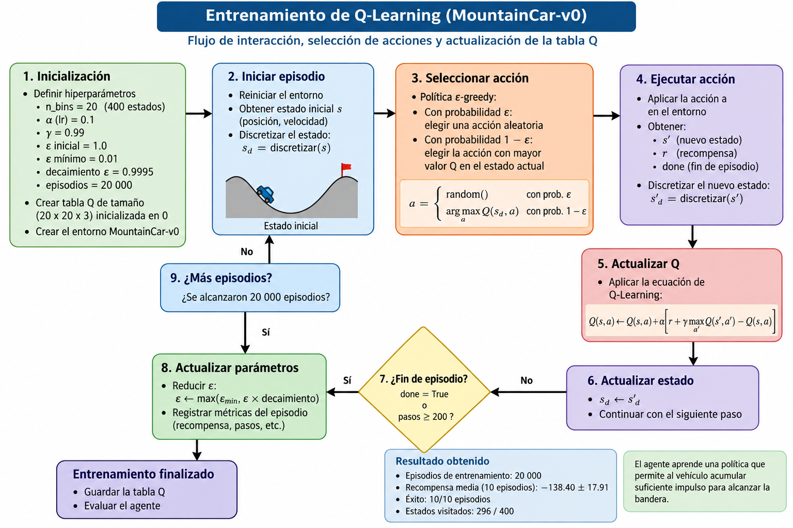
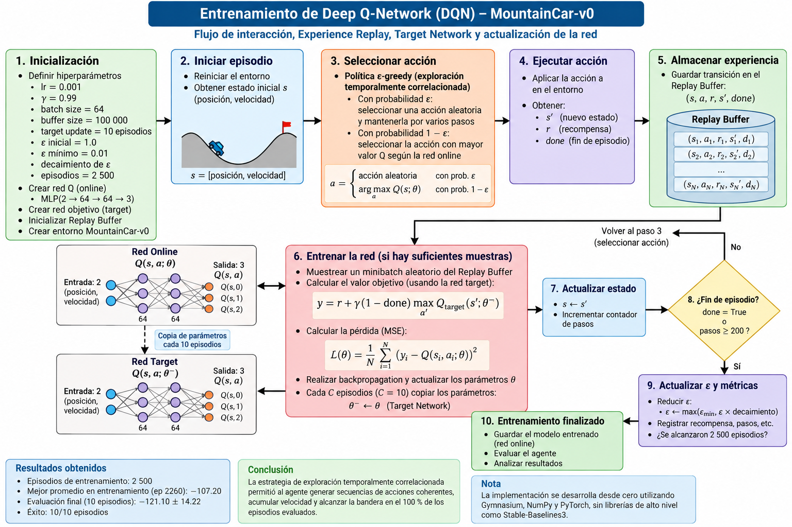
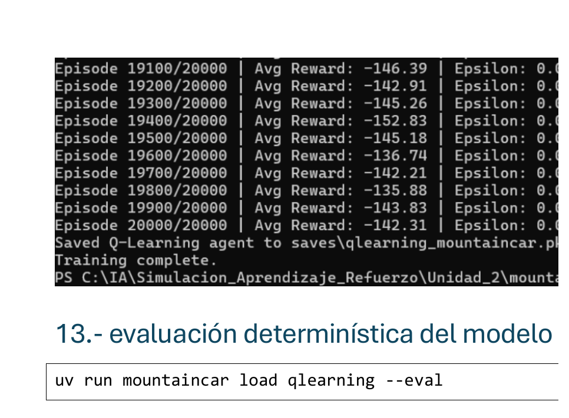
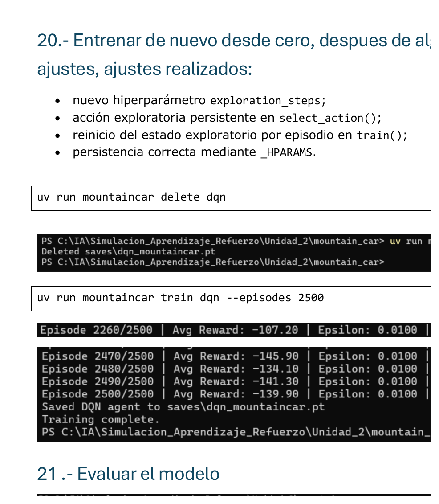

# MountainCar-v0 con Q-Learning y Deep Q-Network (DQN)

## U2 Taller 1 — Simulación y Aprendizaje por Refuerzo

Este repositorio contiene el desarrollo del **Taller 1 de la Unidad 2**, cuyo propósito es implementar, entrenar y comparar dos enfoques de Aprendizaje por Refuerzo para resolver el entorno **MountainCar-v0** de Gymnasium:

- **Q-Learning tabular**, utilizando discretización del espacio continuo de estados.
- **Deep Q-Network (DQN)**, utilizando una red neuronal para aproximar la función de valor-acción \(Q(s,a)\).

El proyecto parte del repositorio base proporcionado para el curso y completa los ejercicios de implementación de ambos agentes. Además del desarrollo de los algoritmos, se realiza un análisis experimental de su comportamiento, sus estrategias de exploración, su estabilidad durante el entrenamiento y el desempeño obtenido.

## Objetivo

Formular el problema de **MountainCar-v0** como un proceso de decisión secuencial y entrenar dos agentes de Aprendizaje por Refuerzo, uno basado en un método tabular clásico y otro en Deep Reinforcement Learning, con el propósito de comparar su desempeño y analizar las ventajas y limitaciones de cada aproximación.

Los objetivos específicos son:

1. Discretizar el espacio continuo de estados de MountainCar para implementar un agente de **Q-Learning tabular**.
2. Implementar la política de exploración-explotación y la actualización de la función de valor-acción mediante Q-Learning.
3. Implementar un agente **DQN** utilizando una red neuronal, Experience Replay y una Target Network.
4. Analizar el efecto de la estrategia de exploración sobre el aprendizaje del agente DQN en MountainCar.
5. Evaluar ambos agentes utilizando su política aprendida.
6. Comparar Q-Learning y DQN considerando desempeño, estabilidad, velocidad de aprendizaje, complejidad y limitaciones.

## Metodología general

El desarrollo experimental sigue el siguiente flujo:

1. Inspección del entorno **MountainCar-v0** y de sus espacios de observación y acción.
2. Implementación y entrenamiento del agente **Q-Learning tabular**.
3. Evaluación de la política aprendida por Q-Learning.
4. Implementación de la arquitectura y del proceso de aprendizaje del agente **DQN**.
5. Diagnóstico experimental de las dificultades de exploración del DQN en MountainCar.
6. Incorporación de una estrategia de exploración temporalmente correlacionada.
7. Entrenamiento y evaluación final del agente DQN.
8. Comparación de los resultados obtenidos por ambos métodos.

El código de los agentes se implementa directamente sobre **Gymnasium**, **NumPy** y **PyTorch**, permitiendo observar los componentes fundamentales de cada algoritmo sin utilizar librerías de alto nivel que oculten el proceso de aprendizaje.

## MountainCar-v0 environment

An under-powered car sits in a valley. Its engine is too weak to drive straight
up the right-hand hill, so the only way out is to rock back and forth and build
up momentum. The goal is to reach the flag at position `0.5`.

### State (observation) — 2 continuous values

| Index | Variable | Description | Range |
|:---:|---|---|---|
| 0 | position | Position of the car along the x-axis | -1.2 to 0.6 |
| 1 | velocity | Velocity of the car | -0.07 to 0.07 |

### Actions — 3 discrete

| Value | Action |
|:---:|---|
| 0 | Accelerate to the left |
| 1 | Don't accelerate |
| 2 | Accelerate to the right |

### Rewards

| Event | Reward |
|---|---|
| Every step taken | **-1** |
| Reaching the flag (position >= 0.5) | episode ends |

The reward is `-1` per step and nothing else, so the total return is simply the
negative of the episode length: **less negative is better**. Episodes are cut
off after 200 steps, which gives a floor of `-200` for a policy that never
reaches the flag. Anything around `-110` or better is considered solved.

This flat reward is what makes MountainCar interesting: there is no gradient to
follow toward the goal, so the agent has to stumble onto the flag by
exploration before it can learn anything at all.

## Install

### Requisitos

Para ejecutar el proyecto se requiere:

- **Git**
- **Python 3.11**
- **uv**, utilizado para gestionar el entorno virtual y las dependencias del proyecto.

El proyecto define sus dependencias en `pyproject.toml` y utiliza `uv.lock` para mantener versiones reproducibles.

### Clonar el repositorio

```bash
git clone https://github.com/mauricioplascencia/mountain_car.git
cd mountain_car
```

### Instalar las dependencias

Desde la carpeta raíz del proyecto ejecutar:

```bash
uv sync
```

Este comando crea automáticamente el entorno virtual `.venv` e instala las dependencias necesarias, entre ellas:

- Gymnasium con soporte para Classic Control
- NumPy
- PyTorch

### Verificar la instalación

Para comprobar que el entorno y MountainCar funcionan correctamente:

```bash
uv run mountaincar inspect
```

El comando muestra el espacio de observación, el espacio de acciones y algunas transiciones de ejemplo del entorno `MountainCar-v0`.

## USAGE

Todos los comandos del proyecto se ejecutan mediante la interfaz de línea de comandos `mountaincar`:

```bash
uv run mountaincar <command>
```

| Comando | Descripción |
|---|---|
| `version` | Muestra la versión del paquete |
| `list` | Lista los agentes disponibles e indica si existe un modelo guardado |
| `inspect` | Muestra los espacios de estados y acciones y algunas transiciones aleatorias |
| `init <agent>` | Crea y guarda un nuevo agente sin entrenamiento |
| `train <agent>` | Entrena un agente; si existe un modelo guardado, puede continuar desde él |
| `load <agent>` | Muestra la información de un agente guardado y permite evaluarlo |
| `sim <agent>` | Ejecuta episodios con un agente entrenado mostrando las transiciones |
| `render <agent>` | Ejecuta episodios mostrando gráficamente el comportamiento del agente |
| `delete <agent>` | Elimina el archivo guardado de un agente |

El parámetro `<agent>` puede tomar uno de los siguientes valores:

- `qlearning`
- `dqn`

### Inspeccionar el entorno

```bash
uv run mountaincar inspect --steps 3
```

### Entrenar Q-Learning

El entrenamiento utilizado en los experimentos finales fue de 20 000 episodios:

```bash
uv run mountaincar train qlearning --episodes 20000
```

Para consultar la información del agente entrenado y evaluar su política:

```bash
uv run mountaincar load qlearning --eval
```

### Entrenar DQN

El entrenamiento final del agente DQN se realizó durante 2 500 episodios:

```bash
uv run mountaincar train dqn --episodes 2500
```

Para evaluar el agente DQN entrenado:

```bash
uv run mountaincar load dqn --eval
```

### Visualizar un agente entrenado

Por ejemplo, para observar gráficamente el comportamiento del agente Q-Learning:

```bash
uv run mountaincar render qlearning --episodes 3
```

Para DQN:

```bash
uv run mountaincar render dqn --episodes 3
```

> **Nota:** los resultados del entrenamiento pueden variar entre ejecuciones debido a la naturaleza estocástica de los algoritmos de Aprendizaje por Refuerzo y de las estrategias de exploración.

## AGENTS

Los dos agentes se encuentran implementados en `src/mountain_car/agents/` y fueron desarrollados directamente sobre Gymnasium, NumPy y PyTorch, sin utilizar librerías de alto nivel como Stable-Baselines3.

Esto permite observar de forma explícita los principales componentes de los algoritmos de Aprendizaje por Refuerzo utilizados en el taller.

### `qlearning` — Q-Learning tabular

Q-Learning es un algoritmo de Aprendizaje por Refuerzo basado en valores que aprende una función de valor-acción \(Q(s,a)\).

Debido a que `MountainCar-v0` posee un espacio de observación continuo compuesto por posición y velocidad, se realizó una discretización del espacio de estados utilizando una cuadrícula de:

```text
20 x 20 = 400 estados discretos
```

Para cada estado discretizado se almacenan los valores correspondientes a las tres acciones posibles del entorno:

- `0`: acelerar hacia la izquierda.
- `1`: no acelerar.
- `2`: acelerar hacia la derecha.

Por lo tanto, la tabla Q tiene dimensiones:

```text
20 x 20 x 3
```

#### Política epsilon-greedy

Durante el entrenamiento se utiliza una política epsilon-greedy para mantener un equilibrio entre exploración y explotación.

Con probabilidad epsilon el agente selecciona una acción aleatoria y, en caso contrario, selecciona la acción con mayor valor Q para el estado actual.

Los principales hiperparámetros utilizados fueron:

| Hiperparámetro | Valor |
|---|---:|
| Número de bins | 20 |
| Learning rate (`lr`) | 0.1 |
| Factor de descuento (`gamma`) | 0.99 |
| Epsilon inicial | 1.0 |
| Epsilon mínimo | 0.01 |
| Decaimiento de epsilon | 0.9995 |
| Episodios de entrenamiento | 20 000 |

#### Actualización de la tabla Q

La actualización de Q-Learning utiliza la recompensa observada y el máximo valor Q disponible en el siguiente estado:

```text
Q(s,a) <- Q(s,a) + alpha * [r + gamma * max Q(s',a') - Q(s,a)]
```

Al tratarse de un algoritmo **off-policy**, la actualización considera la mejor acción estimada en el siguiente estado independientemente de la acción que posteriormente ejecute la política de exploración.

#### Resultado obtenido

Después de 20 000 episodios de entrenamiento, la evaluación final sobre 10 episodios produjo:

```text
Mean reward: -138.40 +/- 17.91
Reached the flag: 10/10 episodes
States visited: 296 / 400
```

El agente alcanzó la bandera en el 100 % de los episodios evaluados. La recompensa media de `-138.40` indica que necesitó aproximadamente 138 pasos por episodio para alcanzar el objetivo.

---

### `dqn` — Deep Q-Network

DQN extiende el concepto de Q-Learning sustituyendo la tabla Q por una red neuronal que aproxima la función de valor-acción:

```text
Q(s,a; theta)
```

En este caso no es necesario discretizar la observación. La red recibe directamente los dos valores continuos del estado de `MountainCar-v0`:

```text
[position, velocity]
```

y genera como salida tres valores Q, uno para cada acción disponible.

La implementación utiliza los componentes fundamentales de DQN:

- Red neuronal para aproximar la función Q.
- Experience Replay.
- Target Network.
- Actualización basada en la ecuación de Bellman.
- Política epsilon-greedy.
- Estrategia de exploración temporalmente correlacionada.

#### Experience Replay

Las transiciones experimentadas por el agente se almacenan en un Replay Buffer con la forma:

```text
(state, action, reward, next_state, done)
```

Durante el entrenamiento se seleccionan lotes aleatorios de experiencias almacenadas. Esto reduce la correlación temporal entre muestras consecutivas y permite reutilizar experiencias anteriores.

#### Target Network

Además de la red principal utilizada para aprender los valores Q, se mantiene una Target Network separada.

Esta red proporciona valores objetivo más estables durante el cálculo de la actualización de Bellman y se sincroniza periódicamente con la red principal.

Los principales hiperparámetros utilizados fueron:

| Hiperparámetro | Valor |
|---|---:|
| Learning rate (`lr`) | 0.001 |
| Factor de descuento (`gamma`) | 0.99 |
| Batch size | 64 |
| Target update | Cada 10 episodios |
| Epsilon mínimo | 0.01 |
| Capacidad del Replay Buffer | 100 000 |
| Episodios de entrenamiento | 2 500 |

#### Problema de exploración observado

En una primera implementación se utilizó la estrategia epsilon-greedy tradicional, seleccionando independientemente una acción exploratoria aleatoria en cada paso.

Con esta estrategia el entrenamiento permaneció estancado aproximadamente en:

```text
Avg Reward: -200
```

Esto indicaba que el agente no conseguía alcanzar la bandera.

Para investigar el problema se realizaron pruebas adicionales. En 300 episodios utilizando acciones completamente aleatorias se obtuvo:

```text
Episodios: 300
Éxitos: 0
Tasa de éxito: 0.00 %
Promedio de pasos: 200.00
Máxima posición alcanzada: -0.1635
```

El resultado evidenció una característica importante de MountainCar: las acciones aleatorias independientes no generan con facilidad secuencias suficientemente persistentes para acumular el impulso necesario para ascender la montaña.

También se probó la implementación DQN sobre `CartPole-v1`, donde el agente sí mostró aprendizaje progresivo. Esto permitió verificar que la arquitectura general de DQN, el Replay Buffer y el proceso de actualización funcionaban correctamente y que la principal dificultad estaba relacionada con la exploración específica requerida por MountainCar.

#### Exploración temporalmente correlacionada

Para superar esta limitación se incorporó una estrategia de exploración persistente.

Cuando el agente decide explorar, la acción aleatoria seleccionada se mantiene durante varios pasos consecutivos en lugar de generar una nueva acción aleatoria en cada transición.

Esta modificación permite generar secuencias de acciones coherentes que ayudan al vehículo a acumular velocidad y aprovechar la dinámica del entorno para alcanzar la bandera.

Después de incorporar esta estrategia, el agente dejó de permanecer en `-200` y comenzó a aprender políticas capaces de resolver el entorno.

#### Resultado obtenido

El entrenamiento final se realizó durante 2 500 episodios.

Durante el entrenamiento se observó uno de los mejores promedios alrededor del episodio 2 260:

```text
Episode 2260/2500
Avg Reward: -107.20
Epsilon: 0.0100
Buffer: 100000
```

Este resultado supera el valor de referencia convencional de `-110` utilizado para considerar resuelto el entorno.

La evaluación final sobre 10 episodios produjo:

```text
Mean reward: -121.10 +/- 14.22
Reached the flag: 10/10 episodes
```

Aunque la recompensa media de la evaluación final fue inferior al mejor promedio observado durante el entrenamiento, el agente alcanzó la bandera en el 100 % de los episodios evaluados.

Estos resultados muestran que la estrategia de exploración tuvo un impacto determinante sobre el aprendizaje del DQN en `MountainCar-v0`.

## ESQUEMAS DE ENTRENAMIENTO

Los siguientes diagramas representan los procesos de entrenamiento implementados para los dos agentes utilizados en el proyecto.

### Q-Learning

El entrenamiento de Q-Learning parte de la discretización del estado continuo de `MountainCar-v0`. En cada paso, el agente selecciona una acción mediante una política epsilon-greedy, interactúa con el entorno y actualiza directamente la tabla Q utilizando la recompensa obtenida y el máximo valor estimado para el siguiente estado.



El esquema muestra el ciclo fundamental:

```text
Estado → Discretización → Selección de acción → Entorno
       → Recompensa y nuevo estado → Actualización Q → Siguiente estado
```

Este proceso se repite hasta finalizar cada episodio y posteriormente continúa durante los 20 000 episodios utilizados para el entrenamiento.

### Deep Q-Network (DQN)

En DQN, la tabla Q es sustituida por una red neuronal que aproxima los valores `Q(s,a)` directamente a partir del estado continuo.

Las experiencias generadas durante la interacción con el entorno se almacenan en un Replay Buffer. Durante el entrenamiento se seleccionan minibatches aleatorios para actualizar la red online utilizando objetivos calculados mediante la Target Network y la ecuación de Bellman.



El flujo general puede resumirse como:

```text
Estado → Selección de acción → Entorno → Transición
       → Replay Buffer → Minibatch → Red Online
       → Bellman Target → Actualización de la red
```

La Target Network se actualiza periódicamente a partir de los parámetros de la red online. Adicionalmente, para `MountainCar-v0` se implementó una estrategia de exploración temporalmente correlacionada, manteniendo durante varios pasos una acción exploratoria seleccionada aleatoriamente para favorecer la acumulación de impulso.

## RESULTADOS EXPERIMENTALES Y EVIDENCIAS

A continuación se presentan los resultados obtenidos durante el entrenamiento y la evaluación de los agentes Q-Learning y DQN.

### Resultados de Q-Learning

El agente Q-Learning fue entrenado durante 20 000 episodios utilizando una discretización de 20 × 20 para representar el espacio continuo de estados.

La evaluación determinística final sobre 10 episodios produjo:

| Métrica | Resultado |
|---|---:|
| Episodios de entrenamiento | 20 000 |
| Estados discretos | 400 |
| Estados visitados | 296 / 400 |
| Recompensa media de evaluación | -138.40 |
| Desviación estándar | 17.91 |
| Episodios que alcanzaron la bandera | 10 / 10 |
| Tasa de éxito | 100 % |

#### Evidencia del resultado



El resultado muestra que el agente aprendió una política capaz de alcanzar consistentemente la bandera. Una recompensa media de `-138.40` significa que el agente necesitó, en promedio, aproximadamente 138 pasos para completar el episodio, debido a que MountainCar asigna una recompensa de `-1` por cada paso.

Aunque únicamente fueron visitados 296 de los 400 estados discretizados, el agente logró alcanzar el objetivo en todos los episodios de evaluación. Esto muestra que no fue necesario explorar uniformemente todo el espacio discretizado para aprender una política funcional.

---

### Resultados de DQN

La primera implementación de DQN, utilizando exploración epsilon-greedy independiente en cada paso, permaneció aproximadamente en una recompensa promedio de `-200`, indicando que el agente no conseguía alcanzar la bandera.

Después del análisis experimental se incorporó una estrategia de exploración temporalmente correlacionada, manteniendo una acción exploratoria durante varios pasos consecutivos.

El entrenamiento definitivo se realizó durante 2 500 episodios.

Uno de los mejores promedios observados durante el entrenamiento ocurrió alrededor del episodio 2 260:

```text
Episode 2260/2500
Avg Reward: -107.20
Epsilon: 0.0100
Buffer: 100000
```

La evaluación determinística final sobre 10 episodios produjo:

| Métrica | Resultado |
|---|---:|
| Episodios de entrenamiento | 2 500 |
| Mejor promedio observado durante entrenamiento | -107.20 |
| Recompensa media de evaluación | -121.10 |
| Desviación estándar | 14.22 |
| Episodios que alcanzaron la bandera | 10 / 10 |
| Tasa de éxito | 100 % |

#### Evidencia del resultado



El valor `-107.20` corresponde a un promedio observado durante el entrenamiento y no a la evaluación final. Este resultado muestra que, durante el proceso de aprendizaje, el agente llegó a superar el valor de referencia convencional de `-110`.

En la evaluación final independiente se obtuvo una recompensa media de `-121.10 ± 14.22`. Aunque este valor es inferior al mejor promedio observado durante el entrenamiento, el agente alcanzó la bandera en los 10 episodios evaluados.

La diferencia entre la primera ejecución estancada en `-200` y los resultados obtenidos después de modificar la estrategia de exploración evidencia la importancia de generar secuencias de acciones suficientemente persistentes para aprovechar la dinámica de MountainCar.

---

## Comparación Q-Learning vs. DQN

Los resultados permiten comparar ambos enfoques desde el punto de vista del aprendizaje, representación del estado, exploración y complejidad de implementación.

| Criterio | Q-Learning | DQN |
|---|---|---|
| Representación de Q | Tabla Q | Red neuronal |
| Estado utilizado | Discretizado | Continuo |
| Episodios de entrenamiento | 20 000 | 2 500 |
| Mejor resultado observado | Evaluación: -138.40 | Entrenamiento: -107.20 |
| Evaluación final | -138.40 ± 17.91 | -121.10 ± 14.22 |
| Éxito en evaluación | 10/10 | 10/10 |
| Experience Replay | No | Sí |
| Target Network | No | Sí |
| Complejidad de implementación | Menor | Mayor |
| Dependencia de discretización | Sí | No |
| Sensibilidad a la exploración | Moderada | Alta en MountainCar |

### Análisis comparativo

**Q-Learning** presentó una implementación más sencilla y fácilmente interpretable. La tabla Q permite observar directamente los valores aprendidos para cada combinación de estado discretizado y acción. Sin embargo, requiere discretizar el espacio continuo y necesitó 20 000 episodios de entrenamiento para obtener la política evaluada.

**DQN** presentó mayor complejidad debido al uso de una red neuronal, Replay Buffer, Target Network y optimización mediante gradiente. Sin embargo, permite trabajar directamente con las observaciones continuas y alcanzó resultados competitivos utilizando 2 500 episodios de entrenamiento.

La principal dificultad encontrada con DQN fue la exploración. La estrategia epsilon-greedy tradicional produjo un estancamiento en `-200`. La incorporación de exploración temporalmente correlacionada permitió generar secuencias de acciones más coherentes, acumular impulso y aprender una política capaz de alcanzar la bandera.

En la evaluación final ambos agentes alcanzaron el objetivo en el 100 % de los episodios. DQN obtuvo una recompensa media menos negativa (`-121.10`) que Q-Learning (`-138.40`), lo que corresponde a episodios completados en menos pasos, en promedio, dentro de estas evaluaciones.

### Conclusión experimental

Los experimentos muestran dos formas diferentes de aproximar la función de valor-acción en MountainCar. Q-Learning proporciona una solución tabular interpretable cuando el espacio de estados puede discretizarse, mientras que DQN utiliza aproximación mediante redes neuronales y evita la discretización explícita.

El experimento con DQN también mostró que la arquitectura del modelo no es el único factor determinante del aprendizaje. La estrategia de exploración debe ser compatible con la dinámica del entorno. En MountainCar, mantener acciones exploratorias durante varios pasos permitió generar el impulso necesario para descubrir trayectorias útiles y superar el estancamiento observado con exploración aleatoria independiente.

## PROJECT LAYOUT

La estructura principal del proyecto es:

```text
mountain_car/
├── docs/
│   ├── qlearning_training.png       # Diagrama del entrenamiento de Q-Learning
│   ├── dqn_training.png             # Diagrama del entrenamiento de DQN
│   └── evidence/
│       ├── qlearning_result.png     # Evidencia de resultados de Q-Learning
│       └── dqn_result.png           # Evidencia de resultados de DQN
│
├── saves/
│   ├── qlearning_mountaincar.pkl    # Agente Q-Learning entrenado
│   └── dqn_mountaincar.pt           # Modelo DQN entrenado
│
├── src/
│   └── mountain_car/
│       ├── cli.py                   # Interfaz de línea de comandos
│       └── agents/
│           ├── qlearning.py         # Implementación de Q-Learning tabular
│           └── dqn.py               # QNetwork, ReplayBuffer y DQNAgent
│
├── EXERCISES.md                     # Ejercicios planteados en el repositorio base
├── pyproject.toml                   # Configuración y dependencias del proyecto
├── uv.lock                          # Versiones reproducibles de dependencias
└── README.md                        # Documentación del proyecto
```

## Conclusiones

En este proyecto se implementaron y evaluaron dos estrategias de Aprendizaje por Refuerzo para resolver el entorno `MountainCar-v0`: Q-Learning tabular y Deep Q-Network (DQN).

Q-Learning permitió comprobar de forma directa los fundamentos del aprendizaje basado en valores. Mediante la discretización del espacio continuo de estados fue posible representar la función `Q(s,a)` en una tabla y aprender una política que alcanzó la bandera en los 10 episodios de evaluación, con una recompensa media de `-138.40 ± 17.91`.

DQN permitió trabajar directamente con el espacio continuo de observaciones mediante una red neuronal. Su implementación requirió componentes adicionales, entre ellos Experience Replay, Target Network y optimización mediante la ecuación de Bellman. La primera estrategia de exploración utilizada produjo un estancamiento alrededor de `-200`, lo que permitió identificar experimentalmente una limitación de la exploración aleatoria independiente en MountainCar.

La incorporación de exploración temporalmente correlacionada permitió superar este comportamiento. Durante el entrenamiento se alcanzó un promedio de `-107.20` alrededor del episodio 2 260, mientras que la evaluación final obtuvo `-121.10 ± 14.22` y alcanzó la bandera en los 10 episodios evaluados.

La comparación muestra que Q-Learning ofrece una solución sencilla e interpretable cuando el espacio de estados puede discretizarse, mientras que DQN proporciona una representación más flexible mediante aproximación de funciones. El experimento también evidencia que el desempeño de un agente no depende únicamente del algoritmo utilizado, sino de la interacción entre la representación del estado, la estrategia de exploración y la dinámica particular del entorno.

## Referencias

- Farama Foundation. (s. f.). *Mountain Car*. Gymnasium Documentation. https://gymnasium.farama.org/environments/classic_control/mountain_car/

- Lapan, M. (2020). *Deep Reinforcement Learning Hands-On* (2nd ed.). Packt Publishing.

- Sutton, R. S., & Barto, A. G. (2018). *Reinforcement Learning: An Introduction* (2nd ed.). MIT Press.

## Créditos

Este proyecto fue desarrollado como parte del Taller 1 de la Unidad 2 de la asignatura **Simulación y Aprendizaje por Refuerzo**.

La implementación parte del repositorio base del curso:

```text
https://github.com/emiliomunozai/mountain_car
```

A partir de esta base se completaron las implementaciones de Q-Learning y DQN, se realizaron los experimentos de entrenamiento y evaluación, se analizó el problema de exploración en `MountainCar-v0` y se documentaron los resultados obtenidos.